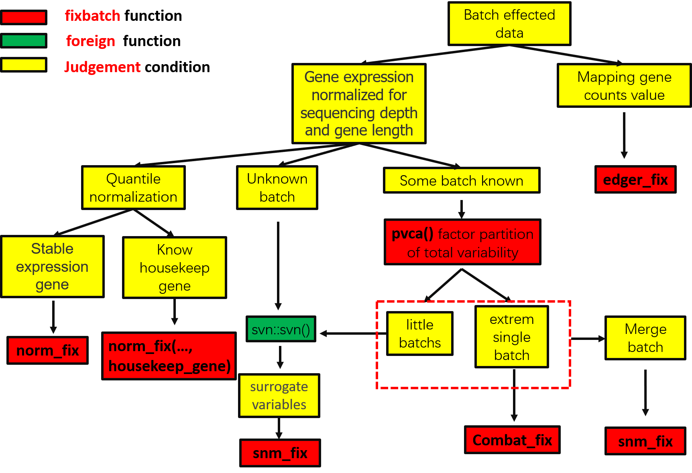

<!-- README.md is generated from README.Rmd. Please edit that file -->

# fixbatch

**Author**: Jiaxuan Wang

<!-- badges: start -->


<!-- badges: end -->

***Fix the batch effect on gene expression workflow!***

Every Gene Expression study such as RNA-seq or Array, has an question
which the researchers want to explain. But in fact, The interested
difference often includes experimental operation difference and
experimental individual differences. The researcher has to decide how to
minimize the impact of technical and other confounding factors on
estimation of the environmental or biological factors of interest. We
can call it “batch effect”.

Leek et. al (2010) define batch effects as follows: &gt; Batch effects
are sub-groups of measurements that have qualitatively different
behaviour across conditions and are unrelated to the biological or
scientific variables in a study. For example, batch effects may occur if
a subset of experiments was run on Monday and another set on Tuesday, if
two technicians were responsible for different subsets of the
experiments, or if two different lots of reagents,chips or instruments
were used.

For remove batch effect. I packages some function which from famous
bacth effect adjust package into a new R package fixbatch. Here I
outline multiple strategies workflow because I recognizes that there is
not a perfect and univers method to adjust batch effects. Maybe we need
choose a better method than others, just because it’s result is more
predicted for us.

The workflow employs several successive procedures available in :



[流程图中文版本](https://pic-1259340288.cos.ap-guangzhou.myqcloud.com/img/workflow-cn.jpg)

## Update log

### fix bug 2020-12-24

-   [x] add the function to select housekeep gene Separately from every
    batch group

-   [x] add the function to select some housekeep gene that you know
    its’ function or famous stable gene like actinB.

-   [x] add the `edger_fix` function to calculate the adjuts expression
    cpm value form `egdeR`

### fix bug 2020-12-27

-   [x] add the `pvca` function form pvca packgas in Bioconductor,this
    function can help us to estimate factors’ partition of the total
    variability. I have made some optimizations,such as suppressMessages
    on useless messages, add test of input data have NAs,fix the the R
    packages dependency relationship. and add `pvca_plot` plot function
    to display the result.

-   [x] add the `combat_fix` copy form `sva`. IT is exactly the same a
    sva::combat, only changing name. the sva website is
    “<https://bioconductor.org/packages/release/bioc/html/sva.html>”

### add function 2020-12-29

-   [x] add the `snm_fix` function to fix batch effect and return the
    normalizeed data. The detailed theory can be found on the
    website(<http://www.bioconductor.org/packages/release/bioc/html/snm.html>).
    I adjusted the input style of parameters to a unified form in
    fixbatch packages.This is not as simple as I imagined.

## Beginning

the R packages is full fo bugs, beacuse it’s a naive packagse, so I
suggest every time when you use the R packages, should update R packages
fristly. Remember this step everytimes!

``` r
devtools::update_packages("fixbatch")
```

## Insatll

``` r
devtools::install_github("wangjiaxuan/fixbatch")
```

``` r
library(fixbatch)
```

## Function

### col\_cv

calculate the coefficient of variation of the row value in a gene
expression matrix.

### col\_sum

calculate the sum of rows value in a gene expression matrix.

### housekeep

According to the coefficient of variation and the expression sum, the
stable observation value is selected

### batch\_housekeep

The function is made for select housekeep gene separately from every
batch group

### norm\_fix

norm\_fix allows users to adjust for batch effects in datasets, using
the function normalize.quantiles from preprocessCore
packages(<http://bioconductor.riken.jp/packages/3.6/bioc/html/preprocessCore.html>).

The goal of the quantile method is to make the distribution of gene
expression intensities for each sample in a set of sample the same. The
method is motivated by the idea that a quantile–quantile plot shows that
the distribution of two data vectors is the same if the plot is a
straight diagonal line and not the same if it is other than a diagonal
line. This concept is extended to n dimensions so that if all n data
vectors have the same distribution.This suggests we could make a set of
data have the same distribution if we project the points of our n
dimensional quantile plot onto the diagonal.This implies that we can
give each array the same distribution by taking the mean quantile and
substituting it as the value of the data item in the original dataset.
This motivates the following algorithm for normalizing a set of data
vectors by giving them the same distribution.

### edger\_fix

Calculate normalization factors to scale the raw library sizes. the
script is created by Yunshun Chen. The work use the function
calcNormFactors and cpm.

### combat\_fix

I add the combat\_fix funtion from svn
packages(<https://bioconductor.org/packages/release/bioc/html/sva.html>).
I just rename it, no change for this function. Maybe it will change the
form of input parameters later.

The snv package contains functions for removing batch effects and other
unwanted variation in high-throughput experiments. Specifically, the sva
package contains functions for identifying and building surrogate
variables for highdimensional data sets. Surrogate variables are
covariates constructed directly from high-dimensional data (like gene
expression/RNA sequencing/methylation) that can be used in subsequent
analyses to adjust for unknown, unmodeled, or latent sources of noise.

The sva package can be used to remove artifacts in two ways: (1)
identifying and estimating surrogate variables for unknown sources of
variation in highthroughput experiments and (2) directly removing known
batch effects using ComBat.

### pvca

The function is written based on the ‘pvcaBatchAssess’ function of the
PVCA R
package(<http://watson.nci.nih.gov/bioc_mirror/packages/release/bioc/manuals/pvca/man/pvca.pdf>).
and adjust by Donghyung Lee for changed slightly to make it more
efficient and flexible for sequencing read counts
data(<https://github.com/dleelab/pvca>). But it didn’t update since 4
years ago. My new R packages fixbatch need the function to estimate
factor’s partition of the total variability. So I fork the packages and
Adjust in my own style.

Principal Variance Component Analysis (PVCA) to explore how technical
and biological factors correlate with the major components of variance
in the data set; Surrogate Variable Analysis (SVA) to identify major
unwanted sources of variation; and Supervised Normalization of
Microarrays (SNM) to efficiently remove these sources of variation while
retaining the biological factor(s) of interest. The data is based on a
study contrasting peripheral blood gene expression in acute myocardial
infarction and coronary artery disease patients, described in Kim et
al. (2014).

### pvca\_plot

Title A plot function for dispaly the result of principal variance
component analysis

### snm\_fix

The function base on snm R
packaegs(<http://www.bioconductor.org/packages/release/bioc/html/snm.html>),
packaged into fixbatch. Citation within R, enter citation(“snm”)).

# 开发过程

1.  [处理批次效应连续剧第一集（失败的R包）](https://mp.weixin.qq.com/s/_LNdR7b4LRhiKGqIcEXX2A)
2.  [处理批次效应连续剧第二集（R包小有成效）](https://mp.weixin.qq.com/s/pWO9em16WE90T-6vxO3HMg)
3.  [处理批次效应连续剧第三集（R包基本OK）](https://abego.cn/2020/12/24/remove-the-batch-effect-series-3-r-package-more-power/)

# References

Leek, J.T. and Storey, J.D. (2007) Capturing heterogeneity in gene
expression studies by surrogate variable analysis. PLOS Genetics, 3.

Mecham, B.H., Nelson, P.S. and Storey, J.D. (2010) Supervised
normalization of microarrays. Bioinformatics, 26, 1308–1315.

B.M. Bolstad, R.A Irizarry, M. Åstrand, T.P. Speed, A comparison of
normalization methods for high density oligonucleotide array data based
on variance and bias, Bioinformatics, Volume 19, Issue 2, 22 January
2003, 185–193.
